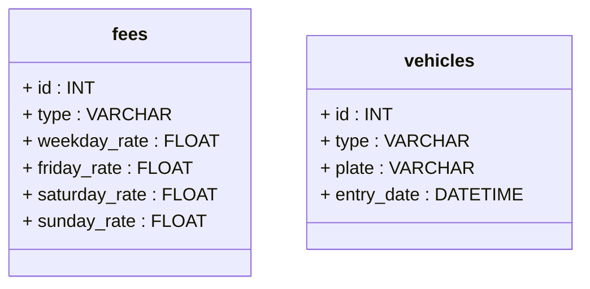

# How to start Front end

1. Open terminal, input command: cd client
2. Run React Front-End using command: npm start

# How to start Back end

1. Open terminal, input command: cd server
2. Run NodeJs Back-End using command: node app.js

### My SQL Database ER Diagram

# Technologies used

1. Back-End: NodeJs
2. Front-End: React
3. Database solution: SQLite
4. Car plate API (https://platerecognizer.com/)
